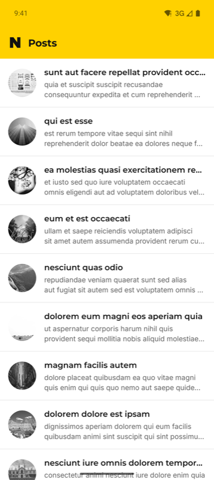
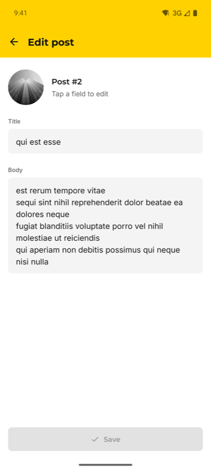
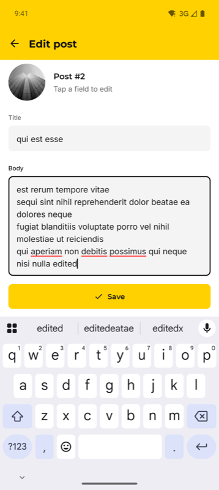
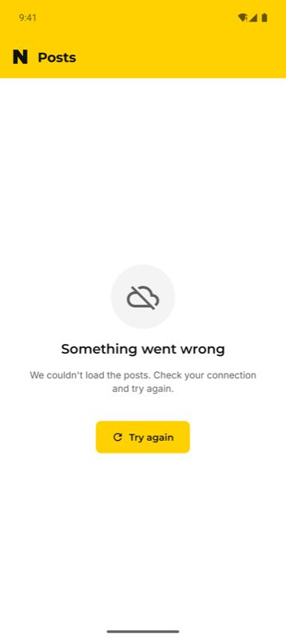
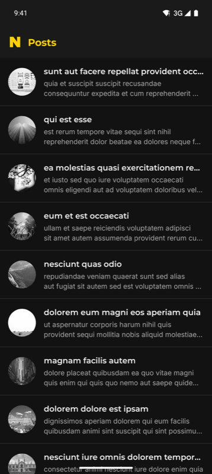
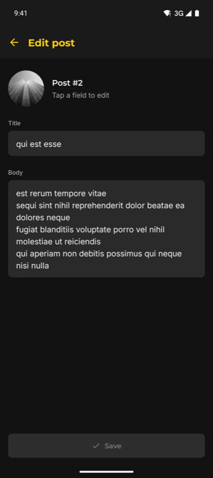
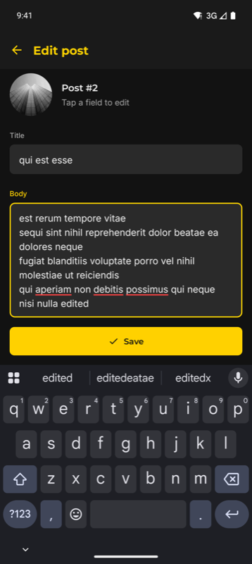
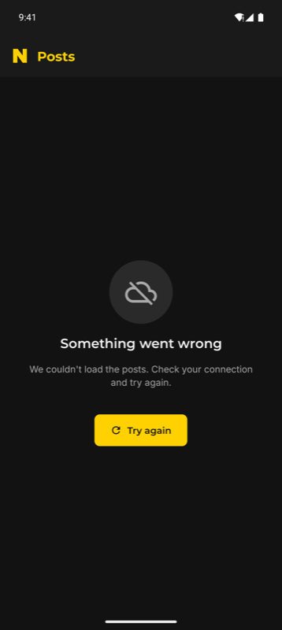

# NPosts — NGaming Case Study

An Android app that lists posts from [JSONPlaceholder](https://jsonplaceholder.typicode.com/posts), lets you edit a post's title and body, and supports swipe to delete with undo. It follows the system light/dark theme and draws edge to edge.

Built with Kotlin, MVVM + Clean Architecture, Hilt, Coroutines/Flow, Retrofit, Navigation Component and XML layouts with ViewBinding.

## Screenshots

| | List | Detail | Editing | Error |
|---|---|---|---|---|
| **Light** |  |  |  |  |
| **Dark** |  |  |  |  |

## Design

The UI is built from the Figma file **[NGAMING Listing App](https://www.figma.com/design/sTouKV3dCMyiDo1Z3vZtOi)**. It holds the foundations (colors, typography, shape, icons) and every screen in light and dark: list, swipe to delete, detail, detail with keyboard, loading, error and empty.

- **Colors** are design tokens in [`design/tokens.json`](design/tokens.json). Each token has a light and a dark value. The Android color resources (`values/colors.xml` and `values-night/colors.xml`) are generated from it by [`tools/generate_colors.py`](tools/generate_colors.py), so no hex values appear in layouts or code.
- **Typography** lives in `res/values/typography.xml` as `TextAppearance.NGaming.*` styles, with Montserrat and Inter bundled in `res/font`.

## Features

- **Post list**: each row shows a circular image, the title and a two-line description, with dividers between rows. Images come from `https://picsum.photos/300/300?random=<position>&grayscale`.
- **Swipe to delete with undo**: swiping a row left deletes it, and the snackbar's Undo puts it back at the same position with the same image. Delete is also available as an accessibility action.
- **Pull to refresh**: fetches the posts again from the API.
- **Edit a post**: tapping a row opens the detail screen. Save is enabled only when the title or body actually changed and neither is blank. Saving returns to the list, which updates immediately.
- **Keyboard aware detail screen**: the Save button stays above the keyboard and the focused field scrolls fully into view.
- **Every screen state**:
  - **Loading**: a shimmer skeleton.
  - **Error**: a retry button that shows a spinner while it retries.
  - **Empty**: shown when every post was deleted, with a button to reload them.
- **Light and dark theme, edge to edge**: the UI follows the system theme and handles system bar, display cutout and keyboard insets.

## Tech stack

| Area | Library |
|---|---|
| Language | Kotlin 2.3 |
| Dependency injection | Hilt |
| Async | Coroutines, Flow / StateFlow |
| Networking | Retrofit 3, OkHttp 5, kotlinx.serialization |
| UI | XML layouts, ViewBinding, Material 3 Components, RecyclerView (`ListAdapter` + `DiffUtil`), SwipeRefreshLayout |
| Navigation | Navigation Component with Safe Args |
| Images | Coil 3 |
| Splash | AndroidX SplashScreen |
| Tests | JUnit 4, kotlinx-coroutines-test |

## Architecture

The app has a single Activity with two Fragments (list and detail) and follows MVVM with Clean Architecture layers. The dependency rule is `ui → domain ← data`: the domain layer has no Android, Retrofit or data imports, and ViewModels depend only on use cases.

```
com.mert.ngamingcasestudy
├── data
│   ├── remote       Retrofit service and DTOs
│   ├── mapper       DTO → domain mapping
│   └── repository   PostRepositoryImpl (single source of truth)
├── domain
│   ├── model        Post, DeletedPost
│   ├── repository   PostRepository interface
│   └── usecase      One use case per action (load, refresh, observe, update, delete, restore)
├── di               Hilt modules (network, repository, dispatchers)
└── ui
    ├── common       BaseFragment, view binding delegate, insets, shimmer, shared helpers
    ├── list         ListFragment, ListViewModel, PostAdapter, swipe callback, skeleton
    └── detail       DetailFragment, DetailViewModel
```

**Unidirectional data flow.** Each ViewModel exposes a single `StateFlow` of UI state, collected with `repeatOnLifecycle`. The Fragment sends user actions back to the ViewModel. One-off actions such as showing a snackbar or navigating back are sent through a separate events channel.

**Repository as the single source of truth.** JSONPlaceholder does not persist writes, so the repository loads the posts once and keeps them in an in-memory `StateFlow<List<Post>>`. Edits, deletes and undo are applied to that list locally. Because both screens observe the same repository, an edit made on the detail screen shows up on the list immediately. A `Mutex` makes sure loading and refreshing never run at the same time.

### Implementation notes

- **Stable images.** The image URL is based on the row position, so a naive implementation shows the wrong image after a delete: the rows below shift up but keep their old images until they are rebound. To avoid this, the list remembers each post's position from the moment the list was loaded. A post keeps its image when other rows are deleted, gets it back on undo, and shows the same image on the detail screen. A refresh assigns positions again from the new list.
- **Retry without flicker.** With no connection a request fails within milliseconds, which made the screen flash between the shimmer and the error. Retrying now keeps the error screen visible and shows a spinner inside the button. If the request fails, the spinner stays for at least 600 ms so the user can see that a retry happened. If it succeeds, the list appears right away.
- **Detail screen drafts.** The text being edited is kept as a draft in the ViewModel and compared with the saved post, so it survives configuration changes such as rotation or a theme switch.

## Getting started

### Requirements

- A recent version of Android Studio that supports Android Gradle Plugin 9.4. See the [compatibility table](https://developer.android.com/build/releases/gradle-plugin#android_gradle_plugin_and_android_studio_compatibility).
- JDK 17 or newer. The JDK bundled with Android Studio works.
- Android SDK Platform 37. Android Studio offers to install it on the first sync if it is missing.
- A device or emulator running Android 7.0 (API 24) or newer, with internet access.

### Run in Android Studio

1. Clone the repository:
   ```bash
   git clone https://github.com/MertTalas/NGamingCaseStudy.git
   ```
2. In Android Studio choose **File → Open** and select the cloned `NGamingCaseStudy` folder.
3. Wait for the Gradle sync to finish. Install any SDK components Android Studio asks for.
4. Select the **app** run configuration and a device or emulator, then press **Run ▶**.

No API keys or extra setup are needed.

### Command line

```bash
./gradlew assembleDebug        # build the debug APK
./gradlew installDebug         # install it on a connected device or emulator
./gradlew test                 # run the unit tests
```

## Tests

The unit tests cover the repository and both ViewModels (24 tests):

- **`PostRepositoryImplTest`**:
  - Mapping, loading only once, and retrying after a failure.
  - Refreshing.
  - Update, delete and restore, including restoring at the original index.
- **`ListViewModelTest`**:
  - Retry and refresh, including the minimum spinner duration and the refresh error.
  - Ignoring repeated taps while a request is running.
  - Keeping images stable across delete, undo and refresh.
- **`DetailViewModelTest`**:
  - The initial state.
  - When Save is enabled.
  - Saving, and the missing post case.

The ViewModel tests use a fake repository and virtual time from `kotlinx-coroutines-test`.

## Known limitations

- **Changes are not saved permanently.** JSONPlaceholder does not store writes, so edits and deletes live only in memory. They are lost when the app process ends or when the list is refreshed or reloaded from the API.
- **Detail screen after process death.** If the system kills the app in the background while the detail screen is open, returning to the app restores that screen with an empty repository, so it shows "This post is no longer available." Going back to the list loads the posts again.
